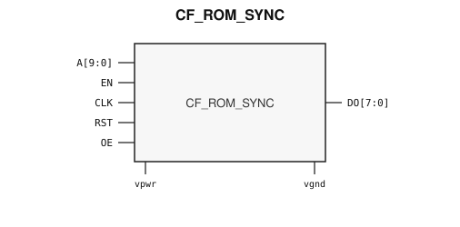

# CF_ROM_SYNC

> Synchronous ROM

Draft for designer review. The public GDS is an abstract; ChipFoundry
substitutes protected full geometry at tapeout.

This package ships an SRAM-style PG wrap `CF_ROM_SYNC` around leaf
`CF_ROM_SYNC_core`.

## Overview

`CF_ROM_SYNC` is a SkyWater 130 nm hard-macro synchronous ROM for boot
images, coefficient tables, and fixed firmware. This drop is the 1K×8
macro (10-bit address, 8-bit data). Instantiate `CF_ROM_SYNC`.

Macro size is 160.18 × 90.42 µm (15 µm halo around leaf 130.18 × 60.42 µm).
Customer PG for chip PDN is `vpwr` / `vgnd`. Well taps `vpb` / `vnb` are
tied inside the wrap.

## Installation

```bash
pip install cf-ipm
ipm install CF_ROM_SYNC --version 0.2.2 --include-drafts
```

Until the marketplace listing is published, install from a local catalog
override:

```bash
ipm install CF_ROM_SYNC --version 0.2.2 --include-drafts --local-file ip/catalog.json
```

Use `hdl/gl/CF_ROM_SYNC.v` as the customer blackbox, `layout/lef/CF_ROM_SYNC.lef`
for P&R, and `layout/gds/CF_ROM_SYNC.gds` / `layout/mag/CF_ROM_SYNC.mag` for the
public wrap. `CF_ROM_SYNC_core` is the ROM leaf (empty Verilog, pin-only
abstract). ChipFoundry substitutes vault GDS into `CF_ROM_SYNC_core` at tapeout.
P&R uses the wrap LEF (`vpwr` / `vgnd` for chip PDN). Liberty in `timing/lib/`
is rewritten onto the wrap cell.

## Features

- Synchronous 1K×8 ROM (`A[9:0]`, `DO[7:0]`)
- Clock `CLK`, enable `EN`, reset `RST`, output enable `OE`
- Customer cell `CF_ROM_SYNC` 160.18 × 90.42 µm (15 µm halo around leaf 130.18 × 60.42 µm)
- Chip PDN is `vpwr` / `vgnd`

## Pinout

Customer documentation includes a pinout of the integration cell only.
Internal schematics and architecture block diagrams are not published.



Pin names and directions match the public wrap (`layout/lef/CF_ROM_SYNC.lef`)
and the blackbox stub (`hdl/gl/CF_ROM_SYNC.v`).

## Pin Description

Directions and widths are taken from the shipped Verilog in `hdl/gl/CF_ROM_SYNC.v`.

| Name | Direction | Width | Description |
|---|---|---:|---|
| `DO` | output | 8 | Synchronous read data. |
| `A` | input | 10 | Address. |
| `EN` | input | 1 | Macro enable. |
| `CLK` | input | 1 | Synchronous clock. |
| `RST` | input | 1 | Reset. |
| `OE` | input | 1 | Output enable. |
| `vpwr` | input | 1 | Core supply. |
| `vgnd` | input | 1 | Ground. |

`CF_ROM_SYNC_core` also has well taps `vpb` / `vnb`. The wrap ties
`.vpb(vpwr)` and `.vnb(vgnd)`. Do not connect those pins at chip level.

In OpenLane / LibreLane, hook chip PDN with
`PDN_MACRO_CONNECTIONS: "u_cf_rom_sync vccd1 vssd1 vpwr vgnd"` and connect
`.vpwr(vccd1)`, `.vgnd(vssd1)` under `USE_POWER_PINS`. Do not list `vpb` /
`vnb` on the wrapper instance.

## Limitations and Open Issues

- Verilog in `hdl/gl/CF_ROM_SYNC.v` is a structural wrap around an empty
  `CF_ROM_SYNC_core` blackbox. Use `verify/beh_model/CF_ROM_SYNC_core.v` for
  ideal functional simulation, not the empty GL stub. That model is a zero
  image. The programmed ROM image is not in this public package.
- Liberty lists wrap-cell timing with well taps still present on the leaf
  model. P&R uses the wrap LEF (`vpwr` / `vgnd` only).
- This drop is the 1K×8 macro. Larger catalog densities are not in this
  package.
